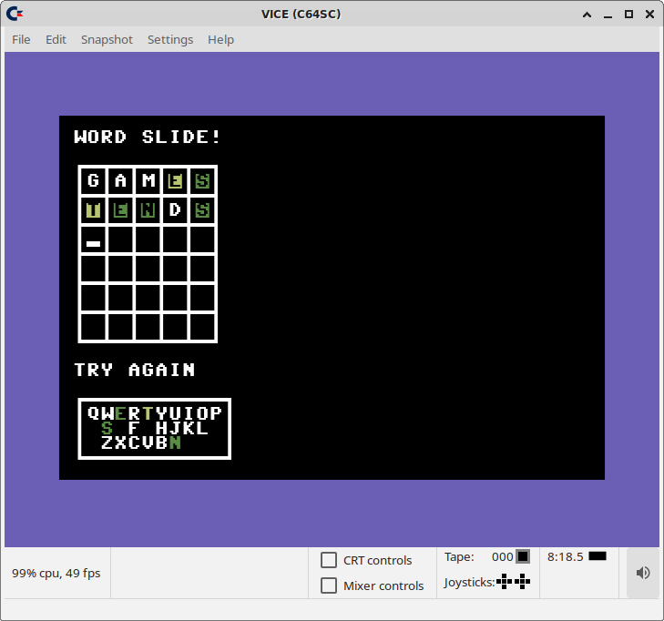
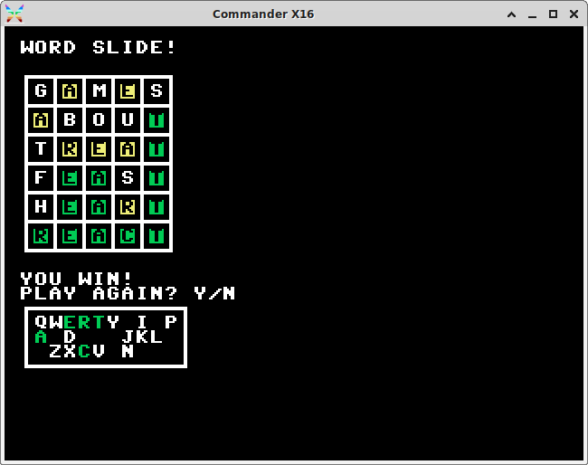

# Word Slide!
Guess a 5-letter word, for CBM-based machines (Commodore 64, Commander X16, etc.)

## Gameplay


You get six chances to guess the secret word. It is one of about 2500 commonly-used
English words with exactly 5 letters. Just type the word and hit RETURN/ENTER to
see if you guessed it correctly. If you had any letters in the correct position,
they will be highlighted as green. If you guessed a letter that is in the secret
word, but in the wrong position, it will be yellow. Any letters that aren't
highlighted are not in the secret word, so you can eliminate those from later
guesses.

For reference, there is a keyboard visualization that removes keys of letters
that have been eliminated, and color codes those that have been found to be
in the secret word. Remember: the secret word may have letters that are found more
that once in its spelling! So, your guess may have a repeated letter, with one
highlighted green and the other yellow. That means that the secret word indeed
has at least two instances of that letter, but only one of them is in the correct
position.



After you guess the word or fail after six tries, you can choose to keep playing
with new random secret words. See how you can bring your average guess count
down and your win percentage up with more practice!

## Build

To build the game, you will need a GNU development environment
(Linux, Mac, Cygwin/MinGW/WSL on Windows) and the following tools in your path:

* gcc
* [cc65](https://github.com/cc65/cc65)

Clone this repo to your own workspace (git recommended, but you can just download
the code from GitHub):

```
$ git clone https://github.com/SlithyMatt/cbm-wordslide.git
```

Then go into your new directory and run the build script (you may need to chmod
make it executable):

```
$ cd cbm-wordslide
$ chmod 755 build.sh
$ ./build.sh
```

This will generate a binary data file named **WORDS.BIN** (and an alternative copy
named **words.bin** for VICE compatibility) and a set of executable
program files for different systems:

* wsc64 - Commodore 64
* WSX16.PRG - Commander X16
* wsvic20 - Commodore VIC-20 (*still under development*)

You will need both files for your desired target machine in a disk image, or
have your emulator map your **cbm-wordslide** working directory to a virtual
disk.

## Running
At this time, you can run the game on a Commodore 64 or a Commander X16.
Just load the executable from the device containing your disk and run it.
If you want to play the game in emulation, follow the steps below.

### Commodore 64 on VICE
First, make sure VICE is configured to map your **cbm-wordslide** working directory
to a virtual disk drive. Go to "Settings"->"Settings..." and in the dialog expand
"Peripheral devices" in the tree sidebar on the left and select the "Drive" branch.
Select the desired drive device from the buttons at the top (device 8 is default),
and in "Device type" select "File system". Then, under "File system device settings",
click the "Browse..." button to select your **cbm-wordslide** working directory.
Makre sure the "Save settings on exit" checkbox is checked and close the dialog.
You may need to restart VICE to make sure it is now mounting that directory as
a disk.

At the BASIC prompt:

```
LOAD "WSC64",8
```

Or if you selected a different device number for this directory, substitute that
for 8.

Then, just run it:

```
RUN
LOADING...
```

While that **LOADING...** message is visible, the game executable is loading
**words.bin**, which will take a little while (it is, after all, emulating
a floppy drive, and the file is over 13 kB). Once the loading is complete, you
should see the game screen, and you are ready to play!

### Commander X16 Emulator
From your **cbm-wordslide** working directory, launch the x16emu program (if it's
not in your path, use its explicit directory).

```
$ x16emu
```

Then at the BASIC prompt, load and run the executable.

```
LOAD "WSX16.PRG"
RUN
```

As you are using the host file system for drive emulation, it should load to the
game screen almost instantaneously. If you are creating your own SD card image,
attaching that to the emulator will make it take a noticeable amount of time
to load, including a **LOADING...** message after you enter **RUN** while the
executable loads **WORDS.BIN**. This is the timing you would expect on the X16
hardware with a physical SD card.

## Support
If you see any apparent bugs, or words that should or shouldn't be included in the
list, please enter an issue on GitHub, or a pull request with your own fix --
adding or removing words from the list (**2500words.txt**) is trivial,
and an easy way to contribute to this project!
